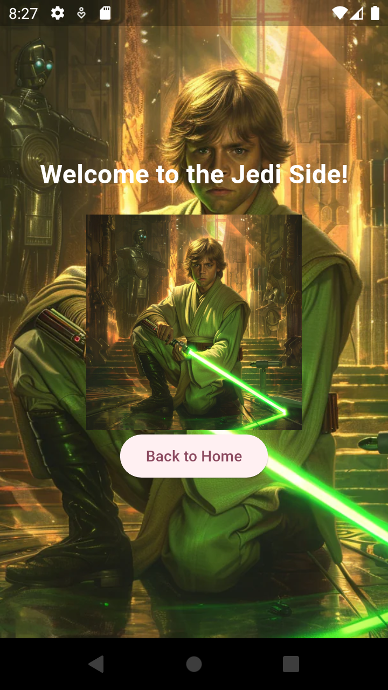

# Mobile Application in Dart(Mobile & Web)

Flutter project.

## Getting Started

This project is a cross platform application which has built its ground in AndroidStudios and is written in dart. 

### Star Wars themed App

This Flutter application allows users to explore the Star Wars universe by choosing between two iconic sides: the Jedi Side or the Dark Side. The app is designed with a clean and engaging user interface, including themed backgrounds and character images for each side. The key features include:

Main Page: Offers two options for users to select from – "Jedi Side" or "Dark Side".
Jedi Page: Displays a themed background and a character image representing the Jedi side, along with a welcoming message.
Dark Side Page: Presents a dark-themed background and a character image of Darth Vader (or a similar character) representing the Sith/Dark Side.
Depending on the user's choice, the app will navigate to the appropriate themed page, providing an immersive experience based on the chosen side of the Force.
## Images 
" 
  alt="home, page" 
  title="homepage"
  width="200px"
  style="display: inline-block; margin: 0 auto; max-width: 50px">
  " 
  alt="jedi, page" 
  title="jedipage"
  width="200px"
  style="display: inline-block; margin: 0 auto; max-width: 50px">
  " 
  alt="darkside, page" 
  title="darksidepage"
  width="200px"
  style="display: inline-block; margin: 0 auto; max-width: 50px">

This project is a starting point for a Flutter application.

A few resources to get you started if this is your first Flutter project:

- [Lab: Write your first Flutter app](https://docs.flutter.dev/get-started/codelab)
- [Cookbook: Useful Flutter samples](https://docs.flutter.dev/cookbook)

For help getting started with Flutter development, view the
[online documentation](https://docs.flutter.dev/), which offers tutorials,
samples, guidance on mobile development, and a full API reference.
